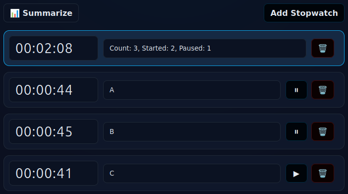

# PWA: The Time Flow

Simple offline-first stopwatches with a names.

## Run locally

Any static server will do. Example with Python:

```bash
python3 -m http.server 5173
```

Then open:

- http://localhost:5173/

Add to Home Screen to use as a PWA. 

<p align="center">
  
</p>